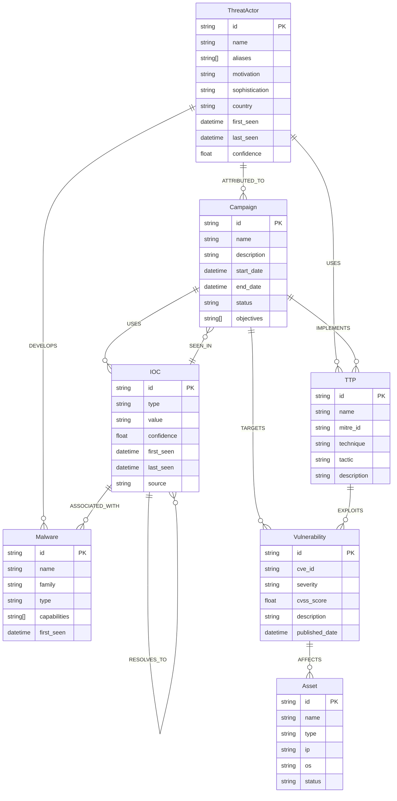

# 🕵️ Threat Intelligence Graph Data Layer
## Multi-Source Threat Intelligence Platform with Real-Time Graph Analytics

[](https://www.python.org/downloads/)
[](https://neo4j.com/)
[](https://fastapi.tiangolo.com/)
[](https://kafka.apache.org/)
[](https://kubernetes.io/)
[](https://terraform.io/)
[](https://pandas.pydata.org/)
[](https://pytest.org/)
[](https://www.docker.com/)

A production-ready threat intelligence platform that transforms raw threat data into actionable intelligence through real-time ingestion, correlation, and analysis. This project addresses the critical challenge of threat intelligence overload by providing a unified graph-based system that connects threat actors, campaigns, IOCs, and attack patterns across multiple external feeds. By leveraging advanced graph analytics and machine learning, it enables security teams to understand complex threat relationships, identify emerging attack campaigns, and make informed decisions faster than ever before. It's not just data processing, it's intelligent threat intelligence that learns, adapts, and provides context-aware insights for proactive defense.

## 🎯 Core Objectives

- **Real-time threat feed ingestion** from multiple external sources (MISP, STIX/TAXII, OTX, commercial feeds)
- **Graph-based threat modeling** with Neo4j for threat actor profiling and attack pattern analysis
- **REST API integration** with existing GNN attack path projects
- **Cross-organizational intelligence sharing** with privacy preservation
- **Automated threat attribution** and campaign tracking

## 🔗 Connected Project

This threat intelligence platform is designed to integrate seamlessly with the **[GNN Attack Path Demo](https://github.com/dgatlin/gnn_attack_path)** - a production-ready demonstration of Graph Neural Networks for cybersecurity attack path analysis with intelligent remediation workflows and multi-agent orchestration. Together, these projects form a complete cybersecurity AI ecosystem.

## 🌟 Highlights

- **Multi-source threat ingestion** from MISP, STIX/TAXII, OTX, VirusTotal, and commercial feeds
- **Real-time graph correlation** with Neo4j for threat actor profiling and campaign tracking
- **Kafka stream processing** for high-throughput real-time threat feed ingestion and event-driven correlation
- **AI-powered threat attribution** with contextual risk scoring and relationship analysis
- **Privacy-preserving intelligence sharing** across organizational boundaries
- **Built-in observability**: Prometheus metrics, structured logs, and monitoring
- **Docker & Kubernetes ready** for enterprise deployment and scaling

## 🌟 Key Features

### 🧠 Threat Intelligence Correlation Engine - The Core AI Innovation


The Threat Intelligence Correlation Engine transforms raw threat feeds into a unified graph database that reveals complex relationships between threat actors, campaigns, IOCs, and attack techniques. Unlike traditional relational databases that struggle with threat intelligence relationships, our Neo4j graph database enables sophisticated multi-dimensional analysis with millisecond query performance.

**Why Graph Database for Threat Intelligence:**
- **Natural Relationship Modeling**: Threat data is inherently graph-structured - actors use techniques, campaigns involve IOCs, malware targets vulnerabilities
- **Complex Query Performance**: Graph traversal queries execute in milliseconds vs minutes in relational databases
- **Scalable Analysis**: Maintains performance as threat data grows exponentially
- **Real-time Correlation**: Excels at finding patterns and connections in real-time

**Core Capabilities:**
- **Multi-dimensional Correlation**: Maps relationships across all threat entities in a unified graph structure
- **Temporal Pattern Recognition**: Tracks attack patterns and campaign evolution through graph traversal
- **Confidence Scoring**: Provides probabilistic assessments based on graph connectivity and historical data
- **Real-time Processing**: Processes new threat intelligence instantly, updating correlation models
- **API Integration**: Provides RESTful APIs for the GNN Attack Path project to consume threat intelligence data
- **Kafka Stream Processing**: Real-time threat feed ingestion and event-driven correlation using Kafka streams for high-throughput data processing

### 📡 Kafka Stream Processing Architecture

The platform leverages Apache Kafka for real-time threat intelligence processing, enabling high-throughput data ingestion and event-driven correlation. Kafka turns the system's feed integrations into an **event-driven** pipeline: one ingestion layer talks to providers; everyone else consumes reliable, replayable streams. That's why it scales, stays resilient, and keeps the system's graph (Neo4j) consistent even when parts fail or slow down.

**Stream Processing Pipeline:**
- **Ingestion**: Threat sources (MISP, STIX/TAXII, OTX) publish to Kafka topics
- **Normalization**: Real-time data processing and validation
- **Graph Updates**: Events trigger immediate Neo4j updates
- **Correlation**: Automatic threat relationship analysis

**Kafka Topics:**
- `threat-feeds-raw` → `threat-feeds-processed` → `correlation-events` → `AI/ML-updates`

**Benefits:**
- **Real-time**: Sub-second updates and correlation
- **Scalable**: Millions of IOCs per day with horizontal scaling
- **Resilient**: Message persistence and replay capability

### 🗄️ Core Threat Entities Data Model

The threat intelligence platform uses a comprehensive graph data model to represent complex threat relationships. This schema defines seven core entity types that capture the full spectrum of threat intelligence data, from threat actors and their campaigns to technical indicators and vulnerabilities. Each entity contains rich metadata and is connected through meaningful relationships that enable sophisticated correlation and analysis.

**Entity Overview:**
- **ThreatActor**: Attackers with attributes like motivation, sophistication, and geographic origin
- **Campaign**: Coordinated attack campaigns with objectives, timelines, and status
- **IOC**: Indicators of Compromise including IPs, domains, hashes, and other technical evidence
- **Malware**: Malicious software families with capabilities and attribution
- **Vulnerability**: CVE vulnerabilities with severity scores and technical details
- **TTP**: MITRE ATT&CK techniques, tactics, and procedures used by threat actors
- **Asset**: Internal organizational assets that may be targeted or affected

The graph structure enables complex queries like "Find all IOCs used by threat actors from country X in campaigns targeting vulnerability Y" through simple graph traversal, something that would require complex JOINs in traditional relational databases.



### 🔗 Key Relationships:
- **ThreatActor** → **Campaign**: `ATTRIBUTED_TO` - Actor responsible for campaign
- **ThreatActor** → **TTP**: `USES` - Actor uses specific techniques
- **ThreatActor** → **Malware**: `DEVELOPS` - Actor develops malware
- **Campaign** → **IOC**: `USES` - Campaign uses specific indicators
- **Campaign** → **Vulnerability**: `TARGETS` - Campaign targets vulnerabilities
- **Campaign** → **TTP**: `IMPLEMENTS` - Campaign implements techniques
- **IOC** → **Malware**: `ASSOCIATED_WITH` - IOC linked to malware
- **IOC** → **Campaign**: `SEEN_IN` - IOC observed in campaign
- **IOC** → **IOC**: `RESOLVES_TO` - Domain to IP resolution
- **TTP** → **Vulnerability**: `EXPLOITS` - Technique exploits vulnerability
- **Vulnerability** → **Asset**: `AFFECTS` - Vulnerability affects asset


## 🚀 Quick Start

### Prerequisites

- Python 3.11+
- Neo4j 5.14+
- Docker & Docker Compose

### Installation

1. **Clone and setup**
```bash
git clone <repository-url>
cd threat_intel_graph
cp env.example .env
# Edit .env with your configuration
```

2. **Install dependencies**
```bash
pip install -r requirements.txt
```

3. **Start Neo4j database**
```bash
docker-compose -f docker/docker-compose.yml up neo4j -d
```

4. **Initialize database schema**
```bash
python scripts/init_database.py
```

5. **Populate with sample threat intelligence data**
```bash
# Option 1: Use the API endpoint (recommended for testing)
curl -X POST http://localhost:8000/api/v1/admin/ingest-sample-data

# Option 2: Start Kafka consumer for real-time processing
python scripts/start_kafka_consumer.py
```

6. **Run development server**
```bash
uvicorn api.main:app --reload --host 0.0.0.0 --port 8000
```

7. **Test API and verify data**
```bash
# Health check
curl http://localhost:8000/api/v1/health

# Check if threat data was populated
curl http://localhost:8000/api/v1/iocs/search?query=malicious

# Get graph export for GNN integration
curl http://localhost:8000/api/v1/graph/export
```

## 📊 API Endpoints

### Core Threat Intelligence

- `GET /api/v1/iocs/asset/{asset_id}` - Get threat context for an asset
- `GET /api/v1/iocs/search` - Search IOCs with filters
- `GET /api/v1/threat-actors/{actor_id}` - Get threat actor details
- `GET /api/v1/campaigns/{campaign_id}` - Get campaign information

### Integration with GNN Project

- `POST /api/v1/correlate/asset` - Correlate threat intelligence with internal assets
- `GET /api/v1/enhance/risk-score` - Enhance risk scores with threat intelligence
- `POST /api/v1/share/threat-intel` - Share threat intelligence (privacy-preserving)

## 🔧 Configuration

Edit `.env` file with your settings:

```env
# Neo4j Configuration
NEO4J_URI=bolt://localhost:7687
NEO4J_USER=neo4j
NEO4J_PASSWORD=threat_intel_password

# External Threat Feeds
MISP_URL=https://your-misp-instance.com
MISP_API_KEY=your_misp_api_key
OTX_API_KEY=your_otx_api_key
VIRUSTOTAL_API_KEY=your_virustotal_api_key
```

## 🐳 Docker Deployment

```bash
# Build and run with Docker Compose
docker-compose -f docker/docker-compose.yml up -d

# View logs
docker-compose -f docker/docker-compose.yml logs -f

# Stop services
docker-compose -f docker/docker-compose.yml down
```

## 🔗 Integration with AI/ML Projects

This API is designed to integrate with AI and machine learning projects that consume graph data, including:

- **Graph Neural Networks (GNNs)** for attack path analysis
- **Knowledge Graph AI** for threat intelligence reasoning
- **Graph-based ML models** for anomaly detection
- **Network analysis tools** for cybersecurity research
- **Graph databases** for complex relationship queries

### Example Integration

```python
# In your AI/ML project
import httpx
import networkx as nx
from typing import Dict, List

class ThreatIntelligenceClient:
    def __init__(self, base_url: str = "http://threat-intel-api:8000"):
        self.base_url = base_url
        self.client = httpx.AsyncClient()
    
    async def get_asset_threat_context(self, asset_id: str) -> Dict:
        """Get threat intelligence context for a specific asset"""
        response = await self.client.get(f"{self.base_url}/api/v1/iocs/asset/{asset_id}")
        return response.json()
    
    async def get_threat_relationships(self, ioc_id: str) -> List[Dict]:
        """Get relationship data for graph-based analysis"""
        response = await self.client.get(f"{self.base_url}/api/v1/iocs/{ioc_id}/relationships")
        return response.json()
    
    async def build_threat_graph(self, seed_iocs: List[str]) -> nx.Graph:
        """Build a NetworkX graph from threat intelligence data"""
        graph = nx.Graph()
        
        for ioc_id in seed_iocs:
            relationships = await self.get_threat_relationships(ioc_id)
            for rel in relationships:
                graph.add_edge(rel['source'], rel['target'], **rel['properties'])
        
        return graph
```

## 📈 Features

- **Multi-source ingestion**: MISP, STIX/TAXII, OTX, VirusTotal, custom feeds
- **Real-time processing**: Kafka streams for high-throughput data ingestion
- **Graph intelligence**: Neo4j for complex threat relationship analysis
- **Privacy-preserving sharing**: Cross-organizational threat intelligence sharing
- **REST API**: Clean integration with AI/ML and graph analysis projects
- **Docker support**: Easy deployment and scaling

## 🧪 Testing

```bash
# Run tests
pytest tests/ -v --cov=api

# Run specific test
pytest tests/test_api.py::test_get_asset_threat_context -v
```

## 📝 License

MIT License - see LICENSE file for details.
